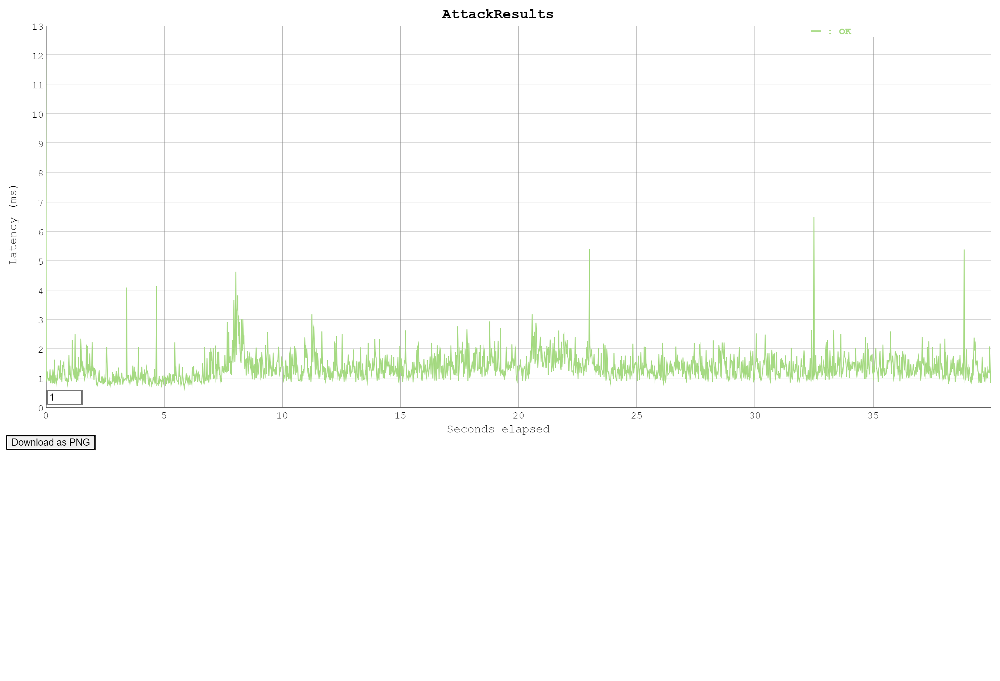

## Установка

#### Чтобы установить проект, следуйте следующим шагам:

1. Клонируйте репозиторий: ```git clone https://github.com/your-repo-url```
2. Запустите контейнеры: ```docker compose up```

## Использование

Чтобы использовать API, отправьте HTTP-запросы по следующим эндпоинтам:

- `GET /ping`: Возвращает код состояния 204 для проверки статуса сервера.
- `GET /health`: Возвращает "ok" для проверки здоровья сервера.
- `GET /data?id={id}`: Возвращает данные в формате JSON по определенному id.

## Конфигурация

Проект использует переменные окружения для конфигурации. Вы можете задать эти переменные в файле `.env` или экспортировать их вручную. Доступны следующие переменные:

- `SERVER_HOST`
- `SERVER_PORT`
- `POSTGRES_DB`
- `POSTGRES_USER`
- `POSTGRES_PASSWORD`
- `POSTGRES_PORT`
- `KAFKA_CONN`

#### Kafka

Для публикации сообщений в Кафку доступен веб интерфейс по адресу `localhost:9000`
Создайте топик orders и публикуйте в него сообщения.


#### Бенчмарк

Бенчмарк был проведен с помощью Vegeta.


